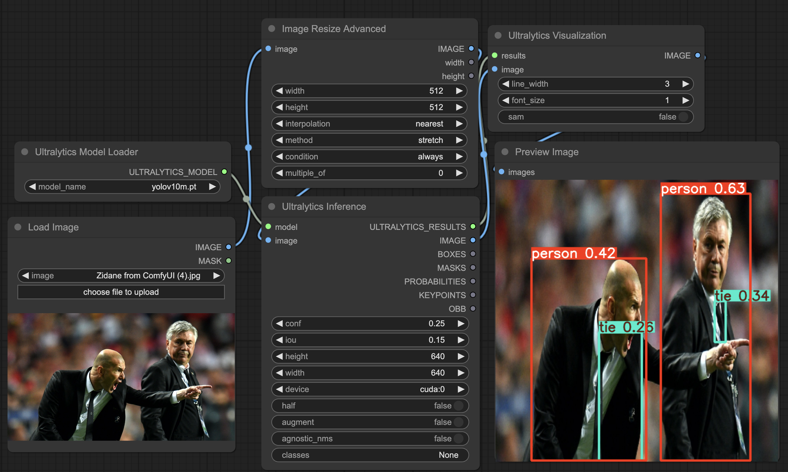
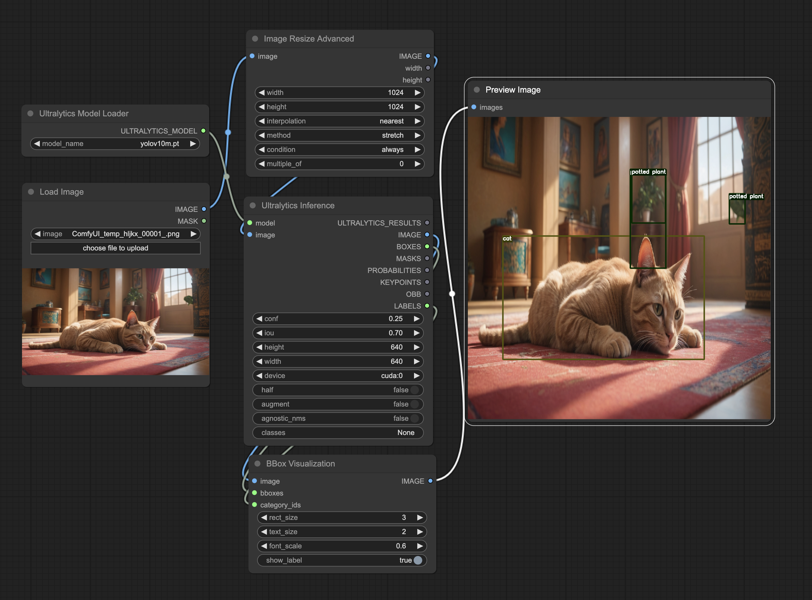

<div align="center">
<h2>
    ComfyUI-YOLO: Ultralytics-Powered Object Recognition for ComfyUI
</h2>
<div>
    
</div>
</div>

## 🛠️ Installation

```bash
cd custom/nodes
git clone https://github.com/kadirnar/ComfyUI-YOLO
```

## 🤗 Model Hub

You can find the models on the [Ultralytics Model Hub](https://github.com/ultralytics/assets/releases)

```bash
cd models/ultralytics
wget https://github.com/ultralytics/assets/releases/download/v8.2.0/model_name.pt
```

## Ultralytics Object Detection


## Ultralytics Video Object Detection


## Ultralytics Object Segmentation


## Ultralytics Object Pose Estimation


## Ultralytics Resize Image



## Ultralytics Bbox Visualization


